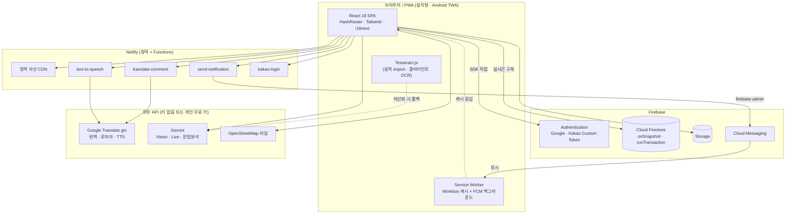

# Meet4U (PromiseU) — 기술 스택

> 약속·모임 스케줄러 PWA. React 19 + Vite 7 SPA 를 Firebase(Auth·Firestore·Storage·FCM) 와
> Netlify Functions 위에 올린 **서버리스 전면 무료** 구성.
>
> **마지막 업데이트: 2026-09-26** · 머신 판독용 원본: [`techstack.json`](./techstack.json)
> (두 파일은 항상 같은 커밋에서 함께 갱신한다.)

---

## 1. 아키텍처

핵심 성질 세 가지:

1. **자체 서버가 없다.** 상태는 전부 Firestore 에 있고, 클라이언트가 SDK 로 직접 읽고 쓴다.
   접근 통제는 애플리케이션 코드가 아니라 `firestore.rules` 가 최종 책임을 진다.
2. **Netlify Functions 는 프록시 역할만 한다.** CORS 우회(번역·TTS), 비밀키가 필요한 작업
   (FCM 전송, 카카오 토큰 교환)만 서버로 내보낸다.
3. **HashRouter 를 쓴다.** 다중 호스팅(Netlify/Vercel/Firebase/gh-pages)에서 rewrite 설정
   없이도 딥링크가 깨지지 않게 하기 위한 선택이다.

---

## 2. 카테고리별 상세

### 프론트엔드 — 코어 런타임/번들러

| 이름 | 버전 | 용도 | 위치·설정 |
|---|---|---|---|
| **React** | ^19.2.4 | UI 컴포넌트/상태 관리(서버 컴포넌트 X, 클라이언트만) | — |
| **ReactDOM** | ^19.2.4 | DOM 렌더링 | — |
| **Vite** | ^7.3.1 | 개발 서버/빌드 도구(ES 모듈 기반) | — |
| **@vitejs/plugin-react** | ^5.1.4 | Vite용 React Fast Refresh/JSX 지원 | — |
| **@vitejs/plugin-legacy** | ^7.2.1 | 구형 브라우저(특히 오래된 안드로이드/iOS WebView) 대응 폴리필 + 레거시 번들 생성 | — |
| **vite-plugin-pwa** | ^1.2.0 | Service Worker 생성, PWA manifest, Workbox runtime caching, FCM SW 통합 | vite.config.js — registerType: autoUpdate, NetworkFirst for js/css, importScripts firebase-messaging-sw-custom.js |

### 프론트엔드 — UI/스타일/아이콘

| 이름 | 버전 | 용도 | 위치·설정 |
|---|---|---|---|
| **Tailwind CSS** | ^3.4.17 | 유틸리티 우선 스타일링 | tailwind.config.js + postcss.config.js |
| **PostCSS** | ^8.5.6 | Tailwind 처리용 CSS 트랜스파일러 | — |
| **autoprefixer** | ^10.4.24 | 벤더 프리픽스 자동 추가 | — |
| **lucide-react** | ^0.563.0 | SVG 아이콘 라이브러리(메뉴/벨/달력 등) | — |
| **Paperlogy (한글 가변형 폰트)** | fonts-archive/Paperlogy @main | 전체 페이지 기본 폰트. 9개 weight(100~900) 모두 jsDelivr CDN 으로 woff2 로드, font-display: swap. Tailwind 의 기본 sans 패밀리에 등록되어 모든 텍스트가 자동 적용. | src/index.css (@font-face × 9), tailwind.config.js (theme.extend.fontFamily.sans), index.html (preconnect jsDelivr + splash font-family) |
| **clsx** | ^2.1.1 | 조건부 className 결합 | — |
| **tailwind-merge** | ^3.4.0 | 충돌하는 Tailwind 클래스 병합 | — |
| **Galaxy/Paper 테마** | in-repo | 사용자 선택형 화면 테마 2종(우주/종이) — index.html에서 사전 클래스 적용 | index.html inline script, document.documentElement.classList.add('theme-galaxy'\|'theme-paper') |

### 프론트엔드 — 라우팅/i18n/날짜

| 이름 | 버전 | 용도 | 위치·설정 |
|---|---|---|---|
| **react-router-dom** | ^7.13.0 | SPA 라우팅(Dashboard/Profile/Settings/AdminPage/GlobalMeetingMap 등) | — |
| **i18next** | ^26.0.6 | 다국어 코어 | — |
| **react-i18next** | ^17.0.4 | React 바인딩(useTranslation) | — |
| **i18next-browser-languagedetector** | ^8.2.1 | 브라우저 언어 자동 감지(zh-CN→zh fallback 등) | — |
| **지원 언어** | ko/en/zh | 한국어/영어/중국어 UI 번역 | src/i18n/locales/{ko,en,zh}.json |
| **글로벌 채팅 번역 지원 언어 (19개)** | in-repo | 글로벌 채팅 메시지 번역 대상 언어: 기존 12개(ko/en/ja/zh-CN/ru/es/vi/mn/ar/fr/km) + 신규 8개(bn 방글라데시·uz 우즈베크·si 신할라·my 미얀마·tl 필리핀·th 태국·id 인니·ne 네팔). LANG_LABEL/LANG_FLAG/SPEECH_LOCALE 사전에 모두 등록. 목록 자체는 src/lib/languages.js 단일 출처이며 프로필 화면과 채팅 헤더 셀렉터가 같은 배열을 공유한다. UI 언어(i18next ko/en/zh)와는 별개 개념 — users/{uid}.preferredLanguage 는 '내가 받을 번역 언어' 다. | src/lib/languages.js (SUPPORTED_LANGUAGES/shortLangLabel), src/Pages/Profile.jsx, src/Components/chat/GlobalChat.jsx 헤더 셀렉터, src/Pages/MobileHome.jsx 프로필 카드 |
| **date-fns** | ^4.1.0 | 날짜 포맷/계산(미팅/달력) | — |

### 프론트엔드 — 지도/시각화

| 이름 | 버전 | 용도 | 위치·설정 |
|---|---|---|---|
| **Leaflet** | ^1.9.4 | 오픈소스 지도 코어(글로벌 미팅 맵) | — |
| **react-leaflet** | ^5.0.0 | React 바인딩 | — |
| **leaflet.markercluster** | ^1.5.3 | 마커 클러스터링 | — |
| **react-leaflet-cluster** | ^4.1.3 | react-leaflet용 클러스터 래퍼 | — |
| **recharts** | ^3.8.0 | 출석 통계 차트(AdminPage 등) | — |

### 백엔드 — 서버리스 함수(Netlify Functions)

| 이름 | 버전 | 용도 | 위치·설정 |
|---|---|---|---|
| **Netlify Functions** | esbuild bundler | API 엔드포인트 호스팅(서버 없음/이벤트 기반) | netlify.toml — directory=netlify/functions, node_bundler=esbuild |
| **translate-comment.js** | in-repo | Google Translate 무료 엔드포인트 프록시(댓글 자동 번역, API 키 없음) | — |
| **text-to-speech.js** | in-repo | Google Translate TTS 프록시(CORS 우회, 댓글 읽어주기) | — |
| **send-notification.js** | in-repo | Firebase Admin SDK 기반 FCM 푸시 전송 | — |
| **firebase-admin** | ^13.7.0 | 서버리스 함수에서 FCM 전송/Firestore 어드민 접근 | FIREBASE_PROJECT_ID/FIREBASE_CLIENT_EMAIL/FIREBASE_PRIVATE_KEY 환경변수 |
| **google-translate-api-x** | ^10.7.2 | 함수 의존성으로 등록되어 있음(현재 코드는 fetch로 translate.googleapis.com 직접 호출). 미사용 시 추후 정리 후보. | — |

### AI/외부 API — 무료 엔드포인트 위주

| 이름 | 버전 | 용도 | 위치·설정 |
|---|---|---|---|
| **Google Translate (무공식 gtx)** | translate.googleapis.com/translate_a/single | 댓글 자동 번역. API 키 없이 client=gtx 호출 — 무료지만 비공식이며 레이트 리밋 위험. | — |
| **Google Translate dt=rm (romanization)** | translate.googleapis.com/translate_a/single?dt=rm | 비라틴 문자(한·중·일·아랍·러시아·태국 등) 타겟의 발음 표기를 라틴 문자로 반환. | — |
| **Google Translate TTS** | translate.googleapis.com/translate_tts | 텍스트→음성 합성(텍스트 ~200자/요청). | — |
| **Google Calendar API** | via @firebase Auth googleProvider scope | Google 로그인 토큰으로 Calendar 읽기/쓰기 | src/lib/googleCalendar.js, hooks/useGoogleCalendar.js |
| **라틴 → 한글 음차 (in-repo)** | in-repo | 프랑스어/영어/독일어/스페인어/이탈리아어/포르투갈어/베트남어 등 라틴 문자 타겟에 대해 한글 발음 가이드 생성. dt=rm이 빈 값을 돌려주는 경우의 fallback. | src/lib/phonetics.js (latinToHangul/getPronunciationDisplay), netlify/functions/translate-comment.js (서버 측 미러) |
| **다국어 문법 분석기 (in-repo)** | in-repo | 일본어/한국어/중국어/영어/프랑스어/스페인어/베트남어 등 myLang 별로 어절을 분해하고 주어/목적어/술어/부사어/조사/관사/전치사 역할을 라벨링. 청크 단위 '/' 분할 + 어절별 발음 표시(라틴은 latinToHangul, 비라틴은 Google dt=rm 병렬 fetch + 캐시). API 키 없이 동작. | src/lib/grammar.js (analyzeSentence/getPhrasePronunciations/fetchFullPronunciation/splitPronunciationByChunks), src/Components/chat/GrammarPopup.jsx, GlobalChat.jsx 메시지 옆 'BookOpen' 버튼 |
| **오늘의 공부 PDF 학습지** | in-repo | GrammarPopup 의 상단 버튼으로 새 창을 띄워 원문/발음/구조/어절 분해를 A4 portrait 14mm margin 으로 정렬하고 window.print()로 PDF 저장. 외부 PDF 라이브러리 없음. 원문이 한국어이고 보는 사람의 언어가 한국어가 아닐 때는 PDF 에도 '🇰🇷 원문 한국어 분석 (참고)' 섹션이 함께 출력됨. | src/Components/chat/GrammarPopup.jsx (buildPrintHtml/openPrintWindow/renderPrintSection), @page A4 + role 색상 인라인 적용 |
| **한국어 원문 통합 학습 레이아웃** | in-repo | GlobalChat 메시지의 srcLang==='ko' 이고 viewer lang!=='ko' 일 때, 한국어/번역/발음/어절 분해를 분리하지 않고 [① 원문(한국어) → 번역 → 발음 → 어절(단어+뜻)] 4단계 카드로 문장별 묶어서 표시. 어절별 한국어 뜻은 Google Translate dt=t 로 병렬 fetch. 한국어 청크 매칭은 챕터 수 동일 시 원문 사용, 다를 시 번역문을 백번역. | src/Components/chat/GrammarPopup.jsx (UnifiedClauseLayout, renderUnifiedPrintSection), grammar.js (getPhraseTranslations/pairKoreanChunks/TRANSLATION_CACHE) |
| **Gemini API (옵션 정밀 분석)** | gemini-2.5-flash → 2.0-flash → flash-latest 폴백 | 관리자 모드 사용자는 VITE_GEMINI_ADMIN_API_KEY(공유)를 사용. 일반 사용자는 GrammarPopup의 ⚙️ 키 등록으로 본인 무료 키를 localStorage에 저장하여 업그레이드 분석 사용. | .env (VITE_GEMINI_ADMIN_API_KEY, gitignored), localStorage(meet4u_gemini_api_key), src/lib/grammar.js (analyzeWithGemini/getGeminiKey) |
| **Gemini Live API (실시간 양방향 통역)** | gemini-2.0-flash-exp | wss://generativelanguage.googleapis.com BidiGenerateContent 로 마이크 PCM 16kHz 입력 → 모델이 상대 언어로 통역하여 24kHz PCM 또는 텍스트로 응답. WebAudio API 로 캡처/리샘플/재생 큐 직접 구현, 외부 SDK 없음. 키는 grammar.js 의 getGeminiKey({isAdmin}) 공유. | src/lib/liveApi.js (LiveTranslatorSession 클래스), src/Components/chat/LiveTranslatorModal.jsx, GlobalChat 헤더의 Radio 아이콘 버튼 |
| **Tesseract.js (무료 클라이언트 OCR)** | ^7.0.0 | 예약 완료 문자 스크린샷을 브라우저 안에서 kor+eng 인식. API 키·서버 비용 0원. 언어 데이터(~15MB)는 최초 1회 CDN 다운로드 후 IndexedDB 캐시. 번들이 커서 사용 시점에만 동적 import. | src/lib/ocrReservation.js (ocrWithTesseract/parseReservations), src/Components/meeting/OcrImportModal.jsx |
| **Gemini Vision (OCR 폴백)** | gemini-2.5-flash → 2.0-flash → flash-latest 폴백 | Tesseract 인식률이 낮을 때 이미지에서 예약 건을 JSON 배열로 직접 구조화 추출. 사용자 개인 무료 키 사용. | src/lib/ocrReservation.js (ocrWithGemini), 키는 grammar.js getGeminiKey 공유 |

### 인증/접근제어

| 이름 | 버전 | 용도 | 위치·설정 |
|---|---|---|---|
| **Firebase Authentication (Google Provider)** | firebase ^12.9.0 | Google OAuth 로그인. prompt:'select_account' 강제. | src/lib/firebase.js |
| **관리자 보호** | in-repo | VITE_ADMIN_ID + SHA-256 해시(VITE_ADMIN_PASSWORD_HASH)로 어드민 페이지 가드 | .env / .env.example |
| **메뉴별 권한** | in-repo | 사용자별 사이드바 메뉴 노출 권한 매핑 | src/lib/menuPermissions.js |

### 데이터/스토리지(Firebase)

| 이름 | 버전 | 용도 | 위치·설정 |
|---|---|---|---|
| **Cloud Firestore** | firebase ^12.9.0 | 유저/약속/댓글/출석/채팅 등 모든 사용자 데이터 | firestore.rules, firestore.indexes.json |
| **Firebase Storage** | firebase ^12.9.0 | 사진/이미지 업로드(약속 첨부, 프로필) | storage.rules — bucket: gen-lang-client-0283055211.firebasestorage.app |
| **Firebase Analytics** | firebase ^12.9.0 | 사용 통계(measurementId: G-D210VT6KP7) | — |
| **Firebase Cloud Messaging(FCM)** | firebase ^12.9.0 | 푸시 알림. 백그라운드 SW와 통합. | public/firebase-messaging-sw.js, public/firebase-messaging-sw-custom.js, src/hooks/useFCM.js |

### Firebase 무료 티어 한도(현재 결제 플랜 미사용 가정)

| 이름 | 버전 | 용도 | 위치·설정 |
|---|---|---|---|
| **Firestore 저장소** | 1 GiB | 총 문서 데이터 크기 — 초과 시 추가 과금 | — |
| **Firestore 일일 읽기** | 50,000회/일 | 초과 시 차단/지연 — 신호등이 모니터 | — |
| **Firestore 일일 쓰기** | 20,000회/일 | 댓글/출석/채팅 폭주 시 위험 | — |
| **Firestore 일일 삭제** | 20,000회/일 | 동일 | — |
| **Storage 저장소** | 5 GiB | 업로드 이미지 누적 한도 | — |
| **Storage 다운로드** | 1 GiB/일 | 이미지 노출 시 대역폭 한도 | — |
| **FCM** | 무제한(공식) | 단, 함수 호출 횟수와 페이로드 크기에 영향 | — |

### Netlify 무료 티어 한도

| 이름 | 버전 | 용도 | 위치·설정 |
|---|---|---|---|
| **Functions 호출** | 125,000회/월 | translate/tts/send-notification 모두 합산 | — |
| **Functions 실행 시간** | 100시간/월 | GCT(Compute time) | — |
| **대역폭** | 100 GB/월 | 정적 자산 + 함수 응답 | — |

### 호스팅/배포

| 이름 | 버전 | 용도 | 위치·설정 |
|---|---|---|---|
| **Netlify** | primary | 정적 호스팅 + Functions | netlify.toml, netlify/functions/* |
| **Vercel** | secondary | 대체 호스팅. SPA fallback rewrites + 캐시 헤더 설정만 있고 API는 없음. | vercel.json |
| **Firebase Hosting** | secondary | rules/indexes 배포(firestore.rules, storage.rules)에 사용. 정적 호스팅도 가능. | firebase.json, .firebase/ |
| **gh-pages** | ^6.3.0 (devDep) | GitHub Pages 배포 보조 스크립트(`npm run deploy`) | — |

### PWA/오프라인

| 이름 | 버전 | 용도 | 위치·설정 |
|---|---|---|---|
| **Service Worker** | Workbox(via vite-plugin-pwa) | 오프라인 캐시 + FCM 백그라운드 수신 | vite.config.js workbox 섹션 |
| **Web App Manifest** | in-repo | PWA 설치 가능. start_url=/, display=standalone, theme #1a1a2e | — |
| **PWA 아이콘** | 192/512px | 홈 화면 아이콘 | public/pwa-192x192.png, public/pwa-512x512.png, apple-touch-icon.png |

### 관찰성/신뢰성

| 이름 | 버전 | 용도 | 위치·설정 |
|---|---|---|---|
| **ServerCapacityIndicator** | in-repo (이 커밋에 신설) | Firestore 읽기/쓰기, Storage 업로드, Netlify Functions 호출 회수를 LocalStorage 카운터로 추적하고, 무료 티어 대비 사용률을 신호등(녹/주/적) + 배터리 UI로 우측 하단에 상시 표시. | src/Components/layout/ServerCapacityIndicator.jsx, src/lib/capacityMonitor.js |

### 산출물/임시 자산

| 이름 | 버전 | 용도 | 위치·설정 |
|---|---|---|---|
| **dist/** | build output | Vite 빌드 결과(배포 대상) | — |
| **_backup/, temp_*.jsx** | snapshots | 이전 버전 백업/임시 파일(레거시 후보) | — |
| **build_error.log, .vite_output.log** | runtime logs | 디버그 로그(레거시 후보) | — |
---

## 3. 왜 이걸 골랐나

| 선택 | 대안 | 고른 이유 |
|---|---|---|
| **Firebase Firestore** | Supabase, 직접 운영 Postgres | `onSnapshot` 실시간 구독이 이 앱의 핵심(출석 토글·채팅·게스트 모집 마감)이라 폴링 없이 즉시 반영된다. 무료 티어로 동호회 규모를 충분히 감당한다. |
| **HashRouter** | BrowserRouter | 호스팅을 옮겨도 rewrite 설정이 필요 없다. SEO 가 필요 없는 로그인 전용 앱이라 해시 URL 의 단점이 없다. |
| **Netlify Functions** | Firebase Cloud Functions | Cloud Functions 는 Blaze(종량제) 플랜이 필요하다. Netlify 무료 티어로 같은 일을 하면서 카드 등록을 피했다. |
| **Tesseract.js (OCR 1순위)** | Google Vision, Gemini 단독 | 완전 무료·오프라인·키 불필요. 예약 문자는 날짜/시간 같은 정형 숫자가 핵심이라 한글 인식률이 다소 낮아도 파서가 보완한다. |
| **Gemini Vision (OCR 폴백)** | — | Tesseract 가 0건을 내면 구조화 추출로 넘긴다. 사용자 개인 무료 키라 운영자 비용이 0이다. |
| **Google Translate `client=gtx`** | 공식 Cloud Translation API | 키 없이 무료. 비공식이라는 리스크는 아래 한계 항목 참고. |
| **Leaflet + OSM** | Google Maps, Kakao Map | 타일 사용료와 키 관리가 없다. |
| **Paperlogy (jsDelivr CDN)** | 로컬 폰트 번들 | 9개 weight 를 번들에 넣으면 빌드가 무거워진다. `font-display: swap` 으로 FOUT 만 감수. |

---

## 4. 외부 의존 서비스 — 헬스·요금 영향

무료 티어만 사용하므로 **한도 초과 = 기능 정지**다. 그래서 우측 하단 배터리 신호등
(`ServerCapacityIndicator`)이 사용률을 상시 표시한다. 서버리스라 `/api/server-health` 가
없으므로 `localStorage` 일·월 카운터로 추정한다.

| 서비스 | 무료 한도 | 초과 시 | 감시 방법 |
|---|---|---|---|
| Firestore 읽기 | 50,000회/일 | 읽기 차단 → 화면 빈 상태 | `capacityMonitor.js` 일 카운터 |
| Firestore 쓰기 | 20,000회/일 | 출석·채팅 저장 실패 | 동일 |
| Firestore 저장소 | 1 GiB | 쓰기 거부 | 콘솔 수동 확인 |
| Storage 저장소 / 다운로드 | 5 GiB / 1 GiB·일 | 이미지 로드 실패 | 업로드 바이트 누적 카운터 |
| Netlify Functions | 125,000회/월 · 100시간/월 | 번역·TTS·푸시 정지 | `window.fetch` 래핑 자동 집계 |
| Netlify 대역폭 | 100 GB/월 | 사이트 정지 | Netlify 대시보드 |
| Gemini (개인 키) | 계정별 무료 티어 | 429 → 분석/OCR 폴백 실패 | 호출부 에러 표면화 |
| Google Translate gtx | 공식 한도 없음(비공식) | 레이트 리밋 시 번역 미동작 | 실패 시 원문 표시 |
| FCM | 사실상 무제한 | — | — |

신호등 임계값은 모든 메트릭 사용률 중 worst 기준 40 / 70 / 90 %.

---

## 5. 알려진 한계

- **Google Translate `client=gtx` 는 비공식 엔드포인트다.** 구글이 언제든 차단할 수 있다.
  차단되면 번역이 조용히 실패하고 원문이 그대로 보인다. 공식 Cloud Translation API 로
  갈아탈 자리는 `netlify/functions/translate-comment.js` 한 곳이다.
- **보안 경계는 전적으로 `firestore.rules` 다.** 클라이언트가 DB 에 직접 접근하므로, UI 에서
  가리는 것만으로는 데이터가 보호되지 않는다. 프로젝트 범위 데이터(예약자 목록·캘린더·채팅
  초대)는 과거 실제로 누출된 전력이 있다. 쿼리를 바꿀 때는 규칙도 같이 본다.
- **`react-leaflet` 5.x + `react-leaflet-cluster` 4.1.3 은 호환이 깨져 있다.**
  `<MarkerClusterGroup>` 안의 `<Marker>` 에 `ref` 를 달면 `TypeError: VM is not a constructor`
  로 페이지 전체가 죽는다. 팝업 제어는 `useMap()` + 좌표 매칭으로 우회한다.
- **Tesseract 언어 데이터가 최초 1회 약 15 MB 다.** 모바일 데이터에서는 첫 OCR 이 느리다.
  이후에는 IndexedDB 캐시로 빨라진다.
- **번들이 약 1.8 MB(gzip 552 kB)로 크다.** 현재 코드 분할은 Tesseract 동적 import 뿐이다.
- **`node_modules` 가 저장소에 추적되고 있다.** `git add -A` 를 쓰면 수천 건의 허위 삭제가
  스테이징된다. 항상 파일 경로를 명시해서 add 한다.
- **UI 언어와 번역 언어가 서로 다른 개념이다.** i18next 의 UI 언어는 ko/en/zh 3종이고,
  `users/{uid}.preferredLanguage` 는 채팅 번역 대상 19종이다. 후자를 바꿀 수 없으면 모두가
  `ko` 로 남아 한국어→한국어 번역이 건너뛰어지므로 "번역이 안 된다"로 보인다.
- **`_backup/`, `temp_*.jsx`, `build_error.log` 등 레거시 파일이 남아 있다.** 정리 후보.
